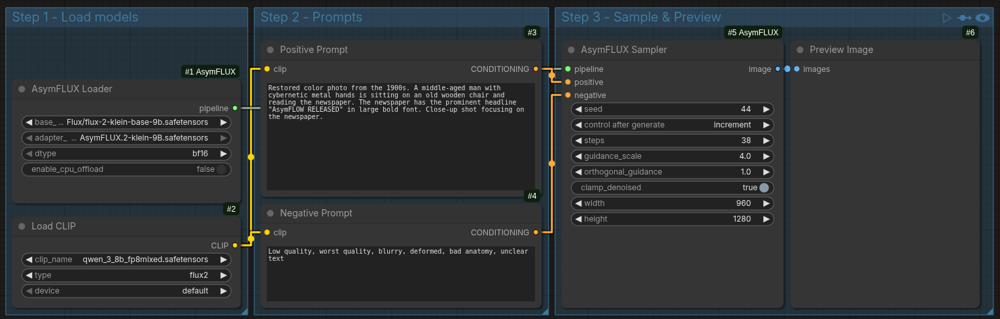

# ComfyUI-AsymFLUX

Custom [ComfyUI](https://github.com/comfyanonymous/ComfyUI) nodes for running [AsymFLUX.2-klein-9B](https://huggingface.co/Lakonik/AsymFLUX.2-klein-9B), a pixel-space text-to-image model fine-tuned from FLUX.2-klein using the [Asymmetric Flow](https://arxiv.org/abs/2605.12964) method.

## Features

- **Pixel-space generation** — outputs images directly, no separate VAE decode needed
- **Negative prompt support** — unlike standard FLUX, AsymFLUX supports classifier-free guidance with negative prompts
- **Pipeline caching** — the 9B model is loaded once and reused across generations
- **CPU offloading** — optional sequential CPU offload for low-VRAM GPUs

## Nodes

| Node | Description |
|------|-------------|
| **AsymFLUX Loader** | Loads the FLUX.2-klein base model and attaches the AsymFLUX adapter |
| **AsymFLUX Sampler** | Runs text-to-image generation using CONDITIONING from CLIP Text Encode nodes, outputs `IMAGE` directly |

## Workflow (piFlow-style)

This extension follows the same pattern as [ComfyUI-piFlow](https://github.com/baptiste146970/ComfyUI-piFlow):




1. **Load the CLIP** text encoder (workflow default: `qwen_3_8b_fp8mixed.safetensors`, type `flux2`)
2. **Encode prompts** using `CLIPTextEncode` nodes (positive + negative)
3. **Load the model** using `AsymFluxLoader` (base model + adapter)
4. **Sample** using `AsymFluxSampler` — connects pipeline, positive conditioning, and negative conditioning
5. **Preview** the output image

See `workflows/txt2img.json` for the ready-to-use workflow shown above.

## Prerequisites

- **ComfyUI** (recent version)
- **PyTorch 2.6+** with CUDA support
- **HuggingFace access** — you must accept the [FLUX.2-klein-base-9B](https://huggingface.co/black-forest-labs/FLUX.2-klein-base-9B) license and run `huggingface-cli login`

## Installation

1. Clone this repo into your ComfyUI `custom_nodes` directory:
   ```bash
   cd ComfyUI/custom_nodes
   git clone https://github.com/alcaitiff/ComfyUI-AsymFLUX.git
   ```

2. Install [LakonLab](https://github.com/Lakonik/LakonLab) (the upstream library):
   ```bash
   cd ComfyUI-AsymFLUX
   pip install -r requirements.txt
   ```

3. Start ComfyUI and load the example workflow from `workflows/txt2img.json`.

## Model Files

| File | Location | Source |
|------|----------|--------|
| `FLUX.2-klein-base-9B.safetensors` | `models/diffusion_models/` | [HuggingFace](https://huggingface.co/black-forest-labs/FLUX.2-klein-base-9B) |
| `AsymFLUX.2-klein-9B.safetensors` | `models/asymflux_adapters/` | [HuggingFace](https://huggingface.co/Lakonik/AsymFLUX.2-klein-9B) |
| `qwen_3_8b_fp8mixed.safetensors` | `models/text_encoders/` | (Flux2 text encoder; workflow default) |

## Recommended Settings

| Parameter | Value | Notes |
|-----------|-------|-------|
| Steps | 38 | As recommended by the authors |
| Guidance Scale | 4.0 | Default from the paper |
| Orthogonal Guidance | 1.0 | Controls CFG orthogonality |
| Clamp Denoised | True | Recommended for pixel-space |
| Resolution | 960×1280 | Paper example resolution |
| dtype | bf16 | Best quality/speed tradeoff |

## Credits

- **AsymFlow paper**: [Asymmetric Flow Models](https://arxiv.org/abs/2605.12964) by Hansheng Chen et al. (Stanford University, 2026)
- **LakonLab**: [github.com/Lakonik/LakonLab](https://github.com/Lakonik/LakonLab)
- **Base model**: [FLUX.2-klein-base-9B](https://huggingface.co/black-forest-labs/FLUX.2-klein-base-9B) by Black Forest Labs

## License

Apache-2.0
